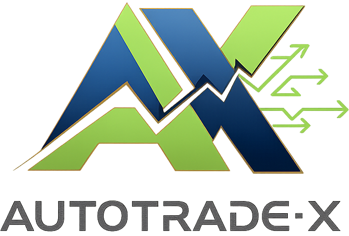

<div align="center">

# 🚀 AutoTrade-X Pro



### **Next-Generation Cross-Exchange Cryptocurrency Arbitrage Platform**

*Unlock automated profit opportunities across 6+ major exchanges with institutional-grade technology*

[](https://github.com/xjanova/autotradex/releases)
[](https://dotnet.microsoft.com/)
[](https://www.microsoft.com/windows)
[](LICENSE)

[🌐 Website](https://xman4289.com/products/autotradex) • [📖 Documentation](https://xman4289.com/docs/autotradex) • [💬 Support](https://xman4289.com/support) • [🛒 Purchase](https://xman4289.com/autotradex/pricing)

---

### Developed with 💜 by **Xman Studio** | Thailand 🇹🇭

</div>

---

## 🏆 Why AutoTrade-X?

<table>
<tr>
<td width="50%">

### 😤 The Problem

Traditional crypto arbitrage faces major challenges:

- ⏰ **Manual monitoring is exhausting** - watching multiple exchanges 24/7
- 🐌 **Human reaction time too slow** - opportunities disappear in milliseconds
- 😰 **Emotional trading leads to losses** - fear and greed affect decisions
- 💸 **High fees eat profits** - inefficient routing wastes money
- 🔧 **Complex setup** - most bots require coding knowledge
- ⚠️ **Security risks** - many bots store API keys insecurely

</td>
<td width="50%">

### 😊 The Solution

AutoTrade-X was built to solve every pain point:

- 🤖 **Fully automated 24/7** - never miss an opportunity again
- ⚡ **Sub-second execution** - capture profits before others
- 🧠 **Emotion-free trading** - algorithmic precision every time
- 💰 **Smart fee optimization** - maximize net profit per trade
- 🎨 **Beautiful no-code UI** - professional interface, zero coding
- 🔒 **Bank-grade security** - encrypted storage, secure protocols

</td>
</tr>
</table>

---

## 📊 AutoTrade-X vs Competitors

| Feature | AutoTrade-X Pro | 3Commas | Pionex | Bitsgap | HaasOnline |
|---------|:---------------:|:-------:|:------:|:-------:|:----------:|
| **Cross-Exchange Arbitrage** | ✅ Built-in | ❌ No | ❌ No | ⚠️ Limited | ⚠️ Complex |
| **Thai Exchange (Bitkub)** | ✅ Native | ❌ No | ❌ No | ❌ No | ❌ No |
| **No Monthly Fees** | ✅ Lifetime option | ❌ $49/mo+ | ❌ Fees | ❌ $29/mo+ | ❌ $99/mo+ |
| **Desktop App (Fast)** | ✅ Native WPF | ❌ Web only | ❌ Web only | ❌ Web only | ✅ Desktop |
| **Modern UI Design** | ✅ Premium | ⚠️ Basic | ⚠️ Basic | ⚠️ Basic | ❌ Outdated |
| **Setup Difficulty** | 🟢 Easy | 🟡 Medium | 🟢 Easy | 🟡 Medium | 🔴 Hard |
| **Language** | 🇹🇭🇬🇧 TH+EN | 🇬🇧 EN only | 🇬🇧 EN only | 🇬🇧 EN only | 🇬🇧 EN only |
| **Local Support** | ✅ Thailand | ❌ No | ❌ No | ❌ No | ❌ No |

### 💡 Key Differentiators

<table>
<tr>
<td align="center" width="25%">
<br/>
<b>Blazing Fast</b><br/>
<sub>Native desktop app = faster than any web platform</sub>
</td>
<td align="center" width="25%">
<br/>
<b>Thai-First</b><br/>
<sub>Only platform with native Bitkub support</sub>
</td>
<td align="center" width="25%">
<br/>
<b>One-Time Payment</b><br/>
<sub>Lifetime license = no recurring fees ever</sub>
</td>
<td align="center" width="25%">
<br/>
<b>100% Secure</b><br/>
<sub>Keys never leave your machine</sub>
</td>
</tr>
</table>

---

## ✨ Features at a Glance

### 🔗 Multi-Exchange Support

| Exchange | Region | Status | Pairs |
|----------|--------|:------:|-------|
| 🟡 **Binance** | Global | ✅ Ready | 500+ |
| 🟢 **KuCoin** | Global | ✅ Ready | 400+ |
| 🔵 **OKX** | Global | ✅ Ready | 300+ |
| 🟠 **Bybit** | Global | ✅ Ready | 300+ |
| ⚪ **Gate.io** | Global | ✅ Ready | 600+ |
| 🔴 **Bitkub** | 🇹🇭 Thailand | ✅ Ready | 50+ |

### 🎯 Core Capabilities

```
┌─────────────────────────────────────────────────────────────────────────┐
│                         AutoTrade-X Architecture                         │
├─────────────────────────────────────────────────────────────────────────┤
│                                                                          │
│   ┌─────────────┐    ┌─────────────────┐    ┌─────────────┐            │
│   │  Exchange A │    │   Arbitrage     │    │  Exchange B │            │
│   │  (Binance)  │◄──►│    Engine       │◄──►│  (Bitkub)   │            │
│   │  BTC: $67k  │    │                 │    │  BTC: $67.5k│            │
│   └─────────────┘    │  • Price Feed   │    └─────────────┘            │
│                      │  • Opportunity  │                                │
│   ┌─────────────┐    │    Detection    │    ┌─────────────┐            │
│   │  Exchange C │    │  • Smart Order  │    │  Exchange D │            │
│   │  (KuCoin)   │◄──►│    Routing      │◄──►│  (Bybit)    │            │
│   │  BTC: $67.2k│    │  • Fee Calc     │    │  BTC: $67.3k│            │
│   └─────────────┘    └─────────────────┘    └─────────────┘            │
│                             │                                           │
│                             ▼                                           │
│                    ┌─────────────────┐                                  │
│                    │   Your Profit   │                                  │
│                    │    Dashboard    │                                  │
│                    │   📈 +$123.45   │                                  │
│                    └─────────────────┘                                  │
│                                                                          │
└─────────────────────────────────────────────────────────────────────────┘
```

### 📋 Feature List

| Category | Features |
|----------|----------|
| **Trading** | ✅ Auto-arbitrage • ✅ Manual mode • ✅ Simulation mode • ✅ Smart routing |
| **Analysis** | ✅ Real-time charts • ✅ P&L tracking • ✅ Trade history • ✅ Performance analytics |
| **Risk Management** | ✅ Stop-loss • ✅ Daily limits • ✅ Position sizing • ✅ Emergency stop |
| **Security** | ✅ Encrypted API keys • ✅ 2FA support • ✅ IP whitelist • ✅ Activity logs |
| **UI/UX** | ✅ Dark theme • ✅ Glass morphism • ✅ Animations • ✅ Responsive design |

---

## 🖼️ Screenshots

<div align="center">

| Dashboard | Trading | Analytics |
|:---------:|:-------:|:---------:|
|  |  |  |
| *Real-time overview* | *Execute trades* | *Track performance* |

</div>

---

## 🚀 Quick Start

### System Requirements

| Component | Minimum | Recommended |
|-----------|---------|-------------|
| OS | Windows 10 | Windows 11 |
| RAM | 4 GB | 8 GB |
| CPU | Dual Core | Quad Core |
| Internet | 10 Mbps | 50+ Mbps |
| .NET | 8.0 Runtime | 8.0 SDK |

### Installation

#### Option 1: Download Installer (Recommended)
1. 📥 Download from [xman4289.com/products/autotradex](https://xman4289.com/products/autotradex)
2. 🖱️ Run installer and follow instructions
3. 🚀 Launch AutoTrade-X and start your trial!

#### Option 2: Build from Source
```bash
# Clone repository
git clone https://github.com/xjanova/autotradex.git
cd autotradex

# Restore & Build
dotnet restore
dotnet build --configuration Release

# Run
dotnet run --project src/AutoTradeX.UI/AutoTradeX.UI.csproj
```

---

## 💳 Pricing Plans

<div align="center">

| | Monthly | Yearly | **Lifetime** |
|:-:|:---------:|:--------:|:------------:|
| **Price** | ฿990/mo | ฿7,900/yr | **฿19,900** |
| **Savings** | - | 33% off | **Best Value** |
| **Updates** | ✅ | ✅ | ✅ Forever |
| **Support** | ✅ Standard | ✅ Priority | ✅ VIP |
| **Exchanges** | 6 | 6 | 6+ Future |

[🛒 **Get Started Now**](https://xman4289.com/autotradex/pricing)

</div>

> 🎁 **Early Bird Offer:** Get 20% OFF during your trial period!

---

## 🔒 Security First

Your security is our top priority:

```
┌──────────────────────────────────────────────────────────────────┐
│                     Security Architecture                         │
├──────────────────────────────────────────────────────────────────┤
│                                                                   │
│  Your Computer                        Our Servers                 │
│  ┌────────────────────┐              ┌─────────────────┐         │
│  │ 🔐 API Keys        │              │ ✅ License Only │         │
│  │    (Encrypted      │──────────────│    No API Keys  │         │
│  │     locally)       │   License    │    No Funds     │         │
│  │                    │   Check      │    No Trades    │         │
│  │ 💰 Your Funds      │              │                 │         │
│  │    (Never leave    │              │ 🛡️ Just verify │         │
│  │     exchange)      │              │    your license │         │
│  └────────────────────┘              └─────────────────┘         │
│                                                                   │
│  ✓ API keys encrypted with AES-256                               │
│  ✓ Keys stored locally only - never uploaded                     │
│  ✓ Trades execute directly on exchanges                          │
│  ✓ We never have access to your funds                            │
│                                                                   │
└──────────────────────────────────────────────────────────────────┘
```

---

## 📖 Documentation

| Topic | Description |
|-------|-------------|
| [🚀 Getting Started](docs/getting-started.md) | First-time setup guide |
| [⚙️ Configuration](docs/configuration.md) | Settings and parameters |
| [🔗 Exchange Setup](docs/exchanges.md) | Connect your exchanges |
| [📊 Trading Strategies](docs/strategies.md) | Optimize your profits |
| [🛡️ Risk Management](docs/risk-management.md) | Protect your capital |
| [❓ FAQ](docs/faq.md) | Common questions |

---

## 🛠️ Tech Stack

<div align="center">

| Layer | Technology |
|:-----:|:----------:|
| **Frontend** | WPF • XAML • Glass Morphism UI |
| **Backend** | .NET 8.0 • C# 12 |
| **Charts** | LiveChartsCore • SkiaSharp |
| **Database** | SQLite • Dapper |
| **Architecture** | Clean Architecture • MVVM |
| **Security** | AES-256 • HMAC-SHA256 |

</div>

---

## 🤝 Support

<table>
<tr>
<td align="center">
<br/>
<b>Live Chat</b><br/>
<a href="https://xman4289.com/support">xman4289.com/support</a>
</td>
<td align="center">
<br/>
<b>Email</b><br/>
support@xman4289.com
</td>
<td align="center">
<br/>
<b>Facebook</b><br/>
<a href="https://fb.me/xmanstudio">@xmanstudio</a>
</td>
<td align="center">
<br/>
<b>LINE</b><br/>
@xmanstudio
</td>
</tr>
</table>

---

## ⚠️ Disclaimer

> **IMPORTANT: Please Read Before Using**
>
> AutoTrade-X is a trading tool, NOT financial advice.
>
> - 📉 **Cryptocurrency trading involves significant risk** - you may lose your entire investment
> - 🎰 **Past performance does not guarantee future results**
> - 🧠 **Only trade with money you can afford to lose**
> - 📚 **This software is for educational purposes** - always do your own research
> - ⚖️ **Users are solely responsible for their trading decisions**
>
> We strongly recommend starting with **Demo Mode** before using real funds.

---

## 📜 License

Copyright © 2024-2025 **Xman Studio**

This software is proprietary. Use requires a valid license.
See [LICENSE](LICENSE) for details.

---

<div align="center">

### 🌟 Ready to Start Profiting?

[**🛒 Get AutoTrade-X Now**](https://xman4289.com/autotradex/pricing)

---


**AutoTrade-X Pro** by **Xman Studio**

*Empowering Thai traders with world-class technology*

🇹🇭 Made with Love in Thailand 🇹🇭

---

<sub>

**v0.1.0-beta** | [Website](https://xman4289.com) | [Support](https://xman4289.com/support) | [Privacy](https://xman4289.com/privacy)

</sub>

</div>
